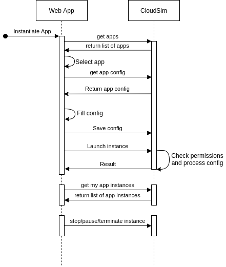

# CloudSim Applications

Starting simulations using cloud resources presents a number of difficulties
including provisioning and resource management, security, network
configuration, and simulation monitoring. After a few iterations of
development, CloudSim is ready to address these difficulties and allow
a user to reliably launch simulation instances in variety of configurations.
This document describes the interfaces needed to make CloudSim available to
a wide audience by abstracting away application instantiating details.

## Use cases

1. As a robot developer, I want to launch a simulation using a set of
   resources available on Fuel along with my dockerized control code for
   debugging and testing purposes.

1. As an educator, I want to give students access to Ignition/Gazebo and ROS
   with lesson materials in a controlled manner.

1. As a participant in a competition, I want to test my solution against
   practice scenarios provided by the competition administrators.

1. As a competition administrator, I want to collect and run submissions in
   a consistent and efficient manner.

## Definitions

1. CloudSim: A backend server that manages cloud resources in order to run
   an application.

1. Application: Code that interfaces with CloudSim to instantiate
   a set of resources.

1. Application Instance: An application that has been launched on CloudSim. 

## Applications

An application interfaces to CloudSim's API in order to fulfill
a specific use case. Example applications could include a virtual robotics competition, a [noVNC](https://novnc.com/info.html) server designed to run a docker image, or standalone simulation instance that exposes a websocket interface.

Each application must be developed and integrated into CloudSim due to the
variety of requirements between application types. The details behind
creation of an application is outside the scope of this document.  An
application developer will need to be familiar with CloudSim's API and how
to create application configurations. Application implementation includes
integration with clouds services, such as EC2 machines, data storage, such
as S3 or Elastic Filesystem, and network configuration. It is assumed that
new applications will be created infrequently.

### Application Instance Configuration

An application defines a configuration that must be completed in order to
run the application. An instance configuration could include the name of the
application instance, a docker image to run, time and/or cost limits.

The configuration for an application is defined by the application
developer. An interface designed to present configuration options to a user
is also created by the application developer.  Configurations can be saved
on the CloudSim server and run at a later time.

We have considered a generic application configuration interface that relies
upon a specification transmitted by the application. For example, an
application could describe all of the form fields for a configuration in
a JSON message. This approach reduces the overhead of application
development while increasing the difficulty to handle branding, data
validation, and configuration corner cases.

### Permissions and Access Control

An application instance behaves as another entity within Ignition Fuel and adheres to the permissions and access control policies established by Ignition Fuel.  

An instance can be marked public or private during the instantiation
process, with the default being private.  A private application instances is
visible to only the owner. The owner may be either and organization or an
individual. If the owner is an organization, then members within the
organization may be able to see and interact with the application instance.

A public application instance will be visible to everyone. This could be
useful for sharing simulations with many users outside of an organization.
For example, a competition may want to host a public demonstration or
tutorial session.

## Instantiating an Application

Application instances can be created through the drop-down menu associated
with the `+` icon in the top right of
[app.igintionrobotics.org](https://app.igintionrobotics.org). When selected
the user will be presented with a list of available applications to choose
from. Upon application selection, a configuration form will be presented to
the user. Once the configuration form is complete, the user may save the
configuration, duplicate the configuration, or launch an application
instance.

The list of available applications will also be accessible through a link on
the left toolbar. Selecting this link will show a page listing applications
that can be created and application instances that are currently active and
accessible to the user, if any. A user will be able to see a history of
their application instances on their profile page

The web user interface relies on a REST API, provided by CloudSim. It is
therefore possible to instantiate applications using command line tools,
such as Curl.

### Instance results

A result is returned when an application is instantiated. This result should
be interpreted by the application developer appropriately. A result may
contain a link to a websocket server that displays live simulation data, or
a link to a noVNC server.

## Batches

A set of instances may be grouped into a batch. This is a logical grouping
designed to support the educator and competition use cases. For example, an
educator may want to establish a batch of instances for a class.
A competition may want to score a set of submissions in a batch.

A batch supports actions that apply to all instances contained within the
batch. This can include starting, stopping, and terminating instances.

## Billing and Cost Management

[Stripe](https://stripe.com) will be used to manage payment for cloud usage.
We will support usage based billing that will occur on a monthly basis or
prepaying for a fixed amount of cloudsim usage. Cloud costs will be tracked
by CloudSim automatically. These costs will be visible to users on
a billing interface page.

A user will be able to enact cost limits and set up billing alerts. Cost
limits will prevent launching new application instances when a limit has
been reached and will also terminate existing instances when a limit has
been reached. A billing alert will send an email to the user based on
a specified cost threshold. Prepaying for a fixed allotment of cloud usage
behaves like a cost limit.

## Examples

**As an educator, I want to give students access to Gazebo11 and ROS Melodic with lesson materials and a workspace that can be accessed across multiple workshops.**

An application developer has created an application that utilizes Docker and
noVNC. The application requires the following configuration information:

1. URL to a docker image that contains Gazebo11, ROS Melodic, and the lesson
   materials. The educator should should create the image.
2. Amount of workspace diskspace to assign to the user who launches the
   application.

Prior to the scheduled class time, the educator creates 1 application
configuration for each student and grants access to the student. 

During class, the student may launch the application and the educator may
view the result. In this case the result is a link to a noVNC instance.

Once class is over the student or educator may terminate each application 
instance. This will trigger the application instance's shutdown process
which invoves saving the students work to their workspace.

**As a participant in SubT, I want to test my solution against a practice scenario.**

An application developer has created the SubT application which launches
Ignition Gazebo with a set of plugins and worlds. Additional machines are
created, one for each robot. Network policies are estables between robots to
prevent cheating, and log files are automatically uploaded to S3.

The participant completes the application's configuration, which consists of

1. The name, type, and docker image for each robot.
2. The name of the practice world.

Once the form is complete, the user may launch the application instance.
The result is a websocket URI which supports live visualization of
simulation.

At any point the application instance may be terminated by the participant,
or the application instance can be left to run until automatice
termination by the application's logic. The termination process will save
log files to S3.
