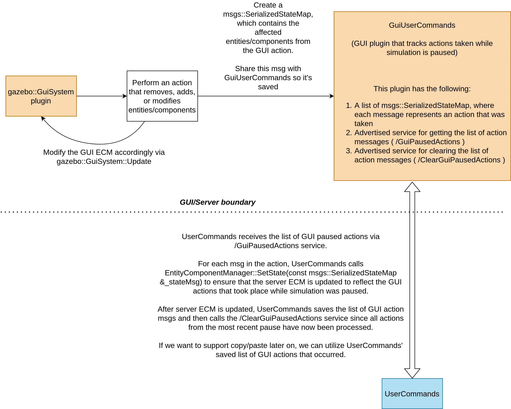

# Synchronization Between the GUI and Server ECM

## Goal
When creating, deleting, or modifying entities/components in the GUI _while paused_,
GUI changes should be reflected in the server once simulation is resumed.

## Approach
Update the ECM on the GUI side directly while simulation is paused.
Once simulation is resumed, let the server ECM know what changes took place in the GUI.
The server ECM will then be updated to match the GUI ECM (unless the GUI and server are run in the same process, which will be discussed below).
Once the ECMs match, simulation will be carried out as normal.

The sequence diagram below depicts what happens when a user performs GUI actions (while simulation is paused) that create, delete, and/or modify entities and components,
and then resumes simulation once the GUI actions are complete.
Steps in this sequence diagram are discussed in greater detail in the `Design Details` section below.

## Design Details

In the sequence diagram above, `gazebo::GuiSystem` and `UserCommands` are systems that already exist in `ign-gazebo`.
The [gazebo::GuiSystem](https://ignitionrobotics.org/api/gazebo/6.0/classignition_1_1gazebo_1_1GuiSystem.html) is a type of GUI plugin that has access to the [EntityComponentManager](https://ignitionrobotics.org/api/gazebo/6.0/classignition_1_1gazebo_1_1EntityComponentManager.html) (ECM).
[UserCommands](https://ignitionrobotics.org/api/gazebo/6.0/classignition_1_1gazebo_1_1systems_1_1UserCommands.html) is a server system that is responsible for executing commands while simulation is running.

`GuiUserCommands` is a new GUI plugin that would need to be implemented.
The purpose of this plugin is to keep track of all GUI actions that occurred while simulation is paused,
and to provide an Ignition Transport interface for sharing these GUI actions.
`GuiUserCommands` keeps a track of all GUI actions through a list of [SerializedState](https://ignitionrobotics.org/api/msgs/8.0/classignition_1_1msgs_1_1SerializedState.html) messages, with each `SerializedState` message containing the state of the GUI's
ECM after the GUI action.
More information about how these messages are created, stored and used can be found in the subsections below.

The steps in the sequence diagram above will now be discussed in greater detail:

### Pause Simulation
The user must first pause simulation in order to perform GUI actions that create, delete,
or modify entities and components.

### Perform GUI action
This is when a user interacts with the GUI in a way that either creates, deletes, or modifies entities and components.
This could be something like clicking a button that adds a sensor to a link, or
changing the properties of an existing joint.

Since the GUI action creates, deletes, or modifies entities and components, a
`gazebo::GuiSystem` plugin should be responsible for handling the action.

### Update ECM (gazebo::GuiSystem)
Once the user performs a GUI action, the GUI's ECM needs to be updated to reflect the action.

If the action was adding a sensor to a link, then a new sensor entity (and its components) would need to be created and added to the GUI's ECM.
If an existing joint had its properties modified, then the joint entity's components
would need to be retrieved from the GUI's ECM and then modified.

The GUI's ECM can be updated in the `gazebo::GuiSystem::Update` method.

### Share GUI action msg, Save GUI action msg
Once the GUI ECM has been updated according to the GUI action, the action needs to be added to the list of actions tracked by `GuiUserCommands`.
The action's `gazebo::GuiSystem` should create a `SerializedState` message (this can be done with
[EntityComponentManager::State](https://ignitionrobotics.org/api/gazebo/6.0/classignition_1_1gazebo_1_1EntityComponentManager.html#a8dbc9cf1c9eb4af335aebc178b6cb6f7)),
and then share this message with `GuiUserCommands` through an ignition transport service call.
`GuiUserCommands` will then save this message and respond to the `gazebo::GuiSystem`,
completing the service request.

### Resume Simulation
Once the user is done applying GUI actions, simulation should be resumed.

### Request GUI action msgs, Send GUI action msgs
On resumption of simulation, the server needs to be aware of the changes that were made through the GUI.
In order to do this, the `UserCommands` system can request all of the actions (`SerializedState` messages) from `GuiUserCommands` through an ignition transport service call.
In order to avoid multiple service calls (one for every GUI action), `GuiServerCommands`
should respond to the service call by building and sending a `SerializedState_V` message.
This would be a new message type that contains a list of `SerializedState` messages.
The order of the messages in this list would match the order of the GUI actions taken by the user (this order is important for undo/redo functionality - see the `Notes/Things to Consider` section below).

### Update ECM (UserCommands)
Once `UserCommands` has the `SerializedState_V` message, the system can update the server's ECM by iterating through the `SerializedState` messages and applying each one
to the ECM (see [EntityComponentManager::SetState](https://ignitionrobotics.org/api/gazebo/6.0/classignition_1_1gazebo_1_1EntityComponentManager.html#a573b9551891a135bce602344e73a2a36)). 
Once all of the messages have been applied to the server's ECM, the GUI and server ECM are now in sync.

### Request to clear GUI action msgs, Clear GUI action msgs
Now that the server and GUI ECM are in sync, the server can send an ignition transport
service request to `GuiUserCommands` to delete all of the GUI `SerializedState` messages.
This is to prevent the server from receiving outdated state messages from the GUI on the next iteration of paused GUI actions.

An alternative approach to sending a service request that would delete all of the
`GuiUserCommands`' `SerializedState` messages is to have `GuiUserCommands` delete any existing `SerializedState` messages whenever simulation changes state from running to paused.

### Resume server simulation operations
Now that the GUI and Server ECMs are in sync and simulation is no longer paused,
simulation can be carried out as normal.

## Notes/Things to Consider

### Server/Client Same Process
When running the server and client in the same process, the server and GUI share the same ECM.
In this scenario, `UserCommands` does not need to iterate through the `SerializedState_V` message from `GuiUserCommands` to update the ECM since the GUI already updated the ECM.
However, the server may still be interested in saving the `SerializedState` messages from the GUI in order to support undo/redo.
It's also important to note that while the server doesn't need to update the ECM, the server should still be notified that changes took place while simulation was paused so
that server plugins can be updated.

### Updating server plugins
While calling `EntityComponentManager::SetState` will help ensure that the GUI and server ECMs match, system plugins will also need to be updated based on the changes
that took place while simulation was paused.
Here are a few scenarios that will need to be considered:
* Is the physics system ready to handle new links being added to a model?
* Does the sensors system correctly handle a geometry change on a visual?
* What happens to the diff-drive plugin if a joint suddenly dissapears?

### Undo/Redo
Since the server receives a list of `SerializedState` messages from the GUI, these
messages can be used to update the ECM during undo/redo.

It also might be worth keeping some of these `SerializedState` messages in `GuiUserCommands` in order to prevent having to make ignition transport
service calls that would retrieve the server's saved `SerializedState` messages for undo/redo requests.

### Serialization
In order to share new, removed, and/or modified entities and components between the server and GUI, the components will need to be serializable.
There are some gazebo components that currently are not serializable.
We should not rely on components that can't be trivially serialized, such as `components::ModelSdf`.

### Component Inspector (GUI)
By modifying the GUI’s ECM directly whenever a user performs a GUI action while simulation is paused,
the component inspector will be updated appropriately since the component inspector uses the GUI’s ECM.
