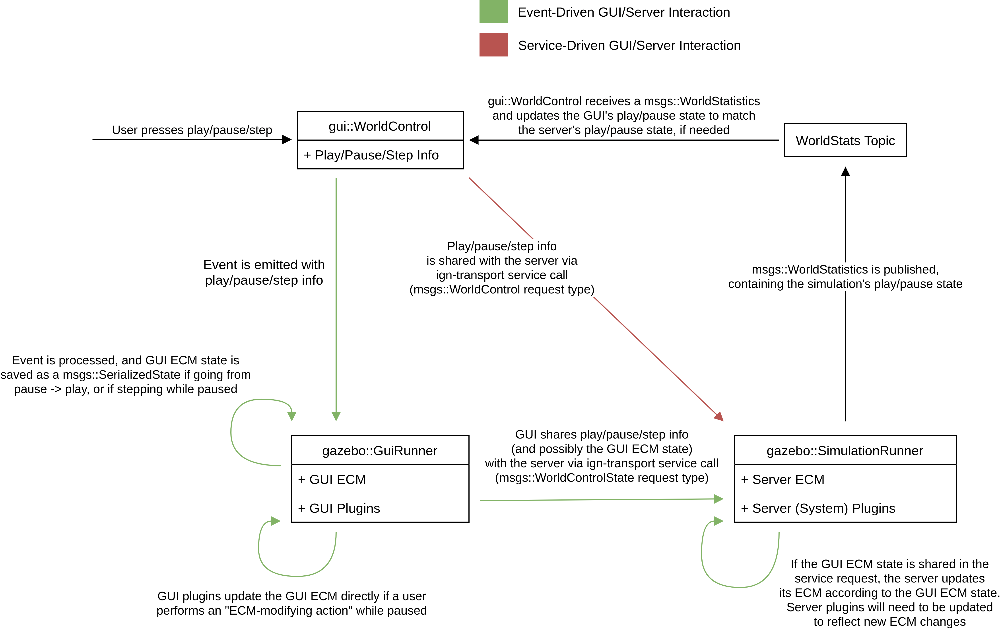

# Synchronization Between the GUI and Server ECM

## Goal
When creating, deleting, or modifying entities/components in the GUI _while paused_,
GUI changes should be reflected in the server once simulation is resumed.

## Approach
Update the ECM on the GUI side directly while simulation is paused.
Once simulation is resumed, let the server ECM know what changes took place in the GUI.
The server ECM will then be updated to have any changes made to the GUI ECM (unless the GUI and server are run in the same process, which will be discussed below).
Once the server ECM is updated, simulation will be carried out as normal.

The image below depicts how changes to the GUI's ECM are propogated to the server's ECM.
The GUI and server interaction can be done through an event (green arrows), or through a service (red arrow).
If GUI and server interaction is done through a service, then there's no way to propogate GUI ECM changes to the server.
The black arrows in the image are things that occur in both the event and service approach.

## Notes/Things to Consider

### How is the ECM shared and processed between the GUI and server?
The GUI will call [EntityComponentManager::State](https://ignitionrobotics.org/api/gazebo/6.0/classignition_1_1gazebo_1_1EntityComponentManager.html#a8dbc9cf1c9eb4af335aebc178b6cb6f7) to serialize its ECM into a `msgs::SerializedState`, and then share this serialized ECM with the server.
Once the server receives this `msgs::SerializedState`, the server will call [EntityComponentManager::SetState](https://ignitionrobotics.org/api/gazebo/6.0/classignition_1_1gazebo_1_1EntityComponentManager.html#a573b9551891a135bce602344e73a2a36) to apply changes in the GUI's ECM to the server's ECM.

### Server/Client Same Process
When running the server and client in the same process, the server and GUI share the same ECM.
In this scenario, the GUI (`gazebo::GuiRunner`) does not need to share its ECM with the server (`gazebo::SimulationRunner`), but the server still needs to make sure that server plugins are updated according to any changes made to the ECM while paused.

### Updating server plugins
While calling `EntityComponentManager::SetState` will help ensure that server ECM is updated according to changes in the GUI's ECM, system plugins will also need to be updated based on the changes
that took place while simulation was paused.
Here are a few scenarios that will need to be considered:
* Is the physics system ready to handle new links being added to a model?
* Does the sensors system correctly handle a geometry change on a visual?
* What happens to the diff-drive plugin if a joint suddenly dissapears?

While the `ign-gazebo` API gives plugins a way to check what entities are new or removed, it does not provide a way to check what entities have recently changed components.
To get around this, when GUI plugins update an entity in the ECM, a component should be attached to the entity that flags it as an entity that was modified while simulation was paused.
When the `gazebo::SimulationRunner` processes changes made to the GUI's ECM, it should also search for entities with this component, and then delete/re-create these entities.
That way, server plugins can listen for newly created entities and operate on them accordingly.

### Undo/Redo
The implementation depicted above does not support undo/redo.
However, looking forward, undo/redo should only be supported while paused since it would be difficult to undo/redo physics.
If undo/redo is only supported while paused, the `gazebo::GuiRunner` can keep track of every action that changed the GUI's ECM while paused through a list of `msgs::SerializedState`.
That way, if a user wanted to undo/redo an action that took place while paused, the `gazebo::GuiRunner` could reset the ECM to the appropriate `msgs::SerializedState`.

### Component Serialization
In order to share new, removed, and/or modified entities and components between the server and GUI, the components will need to be serializable.
There are some gazebo components that currently are not serializable.
We should not rely on components that can't be trivially serialized, such as `components::ModelSdf`.

### Component Inspector (GUI)
By modifying the GUI’s ECM directly whenever a user performs a GUI action while simulation is paused,
the component inspector will be updated appropriately since the component inspector uses the GUI’s ECM.
