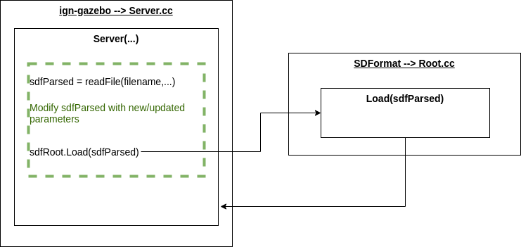

# Pass arguments to SDF files

## Overview

The goal of passing arguments to SDF files is to allow a user to send custom data into a model or world file and prevent model/world file duplication. Currently, there are multiple robot models with the same base but different sensor configurations. For example, in [SubT's robots](https://github.com/osrf/subt/wiki/Robots), X1 has 8-10 different sensor configurations but all have the same base. If we take a look at all the different configurations in [Fuel](https://app.ignitionrobotics.org/), we see that they are essentially copies of each other but with different sensors or different parameters for these sensors. The aim of adding parameter support is to avoid this duplication, where a model/world file contains all configurations with default parameters and a user may update and/or override certain parameters as desired.

### Features

The list of intended **primary features** include:
* Sending data from a world or launch file into a model (e.g., topic names, change parameter values in model(s))
* Enable/disable parts of models and/or worlds

**Secondary features** include:
* Add support to [ign-fuel-tools](https://github.com/ignitionrobotics/ign-fuel-tools) and [Fuel](https://app.ignitionrobotics.org/) web application

### Need to consider:

* Do other libraries (e.g., [ign-physics](https://github.com/ignitionrobotics/ign-physics)) need this capability?

## Implementation

The initial question was whether this process should be a [SDF](http://sdformat.org/) or [ign-gazebo](https://github.com/ignitionrobotics/ign-gazebo) feature. The conclusion is that this will most likely be implemented in ign-gazebo. The reasoning behind this is other organizations use SDF with other simulators, which raises concerns that it could affect their work. Also, this desired argument passing process is intended for ign-gazebo use. Although there may be minor updates to SDFormat and/or libsdformat, the current plan is to implement the main functionality in ign-gazebo. Below describes the current idea to design this new feature.


The figure above shows the current process, where the gazebo `Server` takes in an SDF file and libsdformat loads the SDF object. In libsdformat's `Load(filename)` function, `readFile` loads the file into `sdfParsed` which is an `SDFPtr` that contains the root `sdf::Element` as well as other information about the SDF file. Then the `Load(sdfParsed)` creates the DOM object.



The figure above shows the possible new implementation for the gazebo `Server` (shown in green). Where the server calls `readFile` to load `sdfParsed`. Then the contents of `sdfParsed` will be modified with the new updated parameters set by the user. Finally, `sdfRoot.Load(sdfParsed)` will be called to set up the DOM object.

The reason for this solution is when a file is loaded to a `SDFPtr` then to a DOM object, it is possible that the DOM object and SDF element are not insync. Meaning, modifying the DOM object may not propagate these changes. Therefore the solution was to modify the `SDFPtr` before it is created into a DOM object.

### Parameter Specification

Parameters will be specified by the user in either launch (`.ign`) or world (`.sdf`) files through the use of model [composition (or nested models)](http://sdformat.org/tutorials?tut=composition) which will contain `<include>` tags and [custom elements](http://sdformat.org/tutorials?tut=custom_elements_attributes_proposal&cat=pose_semantics_docs). Model composition provides a way to create a model by nesting other models within itself. Discussed in this section is the proposed design for specifying parameters and the actions available to the user. The intent is to provide a means of manipulating almost all parameters in SDF models through launch/world files without requiring modifications to already existing/created model files. There is a limitation with this proposed approach with specifying plugins since plugins may not have unique names. This will be elaborated later on as well as a potential method of resolving this will be discussed, which may require a user to slightly modify the original model.

In a launch/world file, the user can construct a model using model composition and include components of the model using the `<include>` tag. If a user wants to modify parameters of the included model, then the user will use the custom element `<gazebo:params>` that will contain the adjusted elements. In the custom element `<gazebo:params>`, `gazebo` is the namespace prefix and `params` is the custom element. This approach was chosen so that downstream users can choose to ignore the namespaced custom element and its contents. The included model (not the constructed model in the launch/world file) will be referred to as the original model/file. In the launch/world file and under `<include>`, the elements listed under `<gazebo:params>` will indicate elements from the original model and will specify new values and/or elements to be updated, added, and/or removed.

To specify an element from the original file, the tag (e.g., `<link>`, `<sensor>`, `<visual>`) needs to be provided as well as the name attribute but the name is the name of all the parent elements including its own name separated by double colon (`::`) syntax (e.g., `name="chassis::camera::cam"` where "chassis" is the name of the `<link>`, "camera" is the name of the `<sensor>`, and "cam" is the name of the `<camera>`). This is how the correct element will be identified and will be called the element identifier. Although it is possible to identify the element without requiring the user to specify the tag, enforcing the user to provide the tag allows less ambiguity to the user as well as provides a means of error checking. Then the user will need to specify a corresponding action with that element to dictate the alteration they would like to make using a custom attribute `action`. This attribute takes in a string and the available actions at the specified element are:

* `modify`: indicates that the values in the original model are to be modified to the new listed values
* `replace`: replaces the elements and/or values from the original model to the new provided elements and/or values
* `add`: adds new elements to the original model
* `remove`: removes (or disables) the elements from the original model

Let's look at an example, here is an original model `base_robot`:

```xml
<model name="base_robot">
  ...
  <link name="chassis">
    <visual name="lidar_visual">
      ...
    </visual>
    <sensor name="lidar">
      ...
    </sensor>
    <sensor name="camera">
      <pose>0.5 0.02 0 0 0</pose>
      ...
    </sensor>
  </link>

  <link name="top">
    <visual name="camera_visual">
      ...
      <geometry>
        <box>
          <size>0.03 0.03 0.05</size>
        </box>
      </geometry>
      <material>
        <ambient>0.0 1.0 0.0 1</ambient>
        <diffuse>0.0 1.0 0.0 1</diffuse>
        <specular>0.5 0.5 0.5 1</specular>
      </material>
    </visual>
    <sensor name="camera">
      <pose>0.2 1 0.5 0 0 0</pose>
      <update_rate>20</update_rate>
      ...
    </sensor>
  </link>
```

Now the user would like to use the original model `base_robot` in a launch/world file but with modifications. The modifications include removing the lidar from the chassis link, adding a camera visual to the chassis link, update camera information in the top link, and replace the top link's camera visual geometry.

```xml
<model name="custom_robot">
  <include>
    <uri>model://base_robot</uri>

    <gazebo:params>
      <visual name="chassis::lidar_visual" action="remove"/>
      <sensor name="chassis::lidar" action="remove"/>

      <visual name="chassis::camera_visual" action="add">
        <pose><%= chassis_cam_pose %></pose>
        <geometry>
            <box>
                <size><%= chassis_cam_size %></size>
            </box>
        </geometry>
      </visual>

      <sensor name="top::camera" action="modify">
        <pose><%= top_cam_pose %></pose>
        <update_rate><%= top_cam_update_rate %></update_rate>
      </sensor>

      <visual name="top::camera_visual">
        <geometry action="replace">
          <sphere>
            <radius><%= top_cam_vis_radius %></radius>
          </sphere>
        </geometry>
        <material action="modify">
          <ambient><%= top_cam_ambient %></ambient>
        </material>
      </visual>

    </gazebo:params>
  </include>
</model>
```

**Note**: The above example shows a segment that can be used in an `.ign` launch file which uses ERB. ERB can only be used in launch files and is commonly used for items including variables, embedding logic, and use of Ruby's math library. To learn more, please visit the [ERB tutorial](https://github.com/ignitionrobotics/ign-gazebo/blob/main/tutorials/erb_template.md) and [ign-launch](https://github.com/ignitionrobotics/ign-launch). The same example can be done in world `.sdf` files without the use of ERB but instead of using variables, the actual values need to be provided. For example, if the `chassis_cam_pose`'s vector is `<0,1,1,0,0,0>` then instead of `<pose><%= chassis_cam_pose %></pose>` would need to be `<pose>0 1 1 0 0 0</pose>`. Please refer to the [SDF worlds tutorial](https://ignitionrobotics.org/docs/dome/sdf_worlds) to learn more about world files.

In `<gazebo:params>`, the action can be either listed in the element identifier or listed individually in the children element(s). For example,

```xml
<sensor name="top::camera" action="modify">
  <pose><%= top_cam_pose %></pose>
  <update_rate><%= top_cam_update_rate %></update_rate>
</sensor>
```

The action is defined at the top level where the `name` identifier is, which means that all children listed in this element will be modified. If the user wants to do several different actions to the children elements then the user can specify the action for each child element individually. For instance,

```xml
<visual name="top::camera_visual">
  <geometry action="replace">
    <sphere>
      <radius><%= top_cam_vis_radius %></radius>
    </sphere>
  </geometry>
  <material action="modify">
    <ambient><%= top_cam_ambient %></ambient>
  </material>
</visual>
```

If the original model has several corresponding elements, it will be up to the user to update all appropriately. For example, if a lidar has a `<visual>` and `<sensor>` element and the user would like to remove the lidar information, then both will need to be listed for removal:

```xml
<visual name="chassis::lidar_visual" action="remove"/>
<sensor name="chassis::lidar" action="remove"/>
```

When a user wants to `add` an element that does not exist in the original model, then the `add` action can be used similarly as follows:

```xml
<visual name="chassis::camera_visual" action="add">
  <pose><%= chassis_cam_pose %></pose>
  <geometry>
      <box>
          <size><%= chassis_cam_size %></size>
      </box>
  </geometry>
</visual>
```

In this example, the `<visual>` element named "camera_visual" will be added as a child of `<link name="chassis">`. A check will be performed to ensure that the element does not already exist. If it does exist, then a warning/error will be printed and the element will be skipped. The process of skipping elements will also occur when the user uses the `modify`, `replace`, and/or `remove` actions and the element is not found in the original model.

## Limitations

This method of identifying an element using the name of the source element and its parents, will not work properly with plugins listed in the original model since they are not required to be unique (see [breadcrumbs example](https://github.com/ignitionrobotics/ign-gazebo/blob/e89fc21763ba59ddc4054bbd2f1dbed491d55965/test/worlds/breadcrumbs.sdf#L388)). A proposed solution to this problem is to require the user to add the custom attribute `gazebo:id` to the original file, then instead of using the `name` of the element as the identifier, the `id` will be used. For example, the original model would need to look like:

```xml
<model name="base_robot">
  <plugin filename="ignition-gazebo-breadcrumbs-system" name="ignition::gazebo::systems::Breadcrumbs" gazebo:id="breadcrumb1">
    ...
  </plugin>
  <plugin filename="ignition-gazebo-breadcrumbs-system" name="ignition::gazebo::systems::Breadcrumbs" gazebo:id="breadcrumb2">
    ...
  </plugin>
  ...
</model>
```

Then in `<gazebo:params>`:

```xml
<gazebo:params>
  ...
  <plugin id="breadcrumb2" action="remove"/>
</gazebo:params>
```

Additionally, the user could use the `gazebo:id` attribute to identify other elements in the original file if desired but the intent of using the named path (i.e., the name of the parent elements and itself separated by double colons) as the identifier was to provide a way for the user to modify the original model in a launch/world file without requiring large amounts of updates to the original file.
