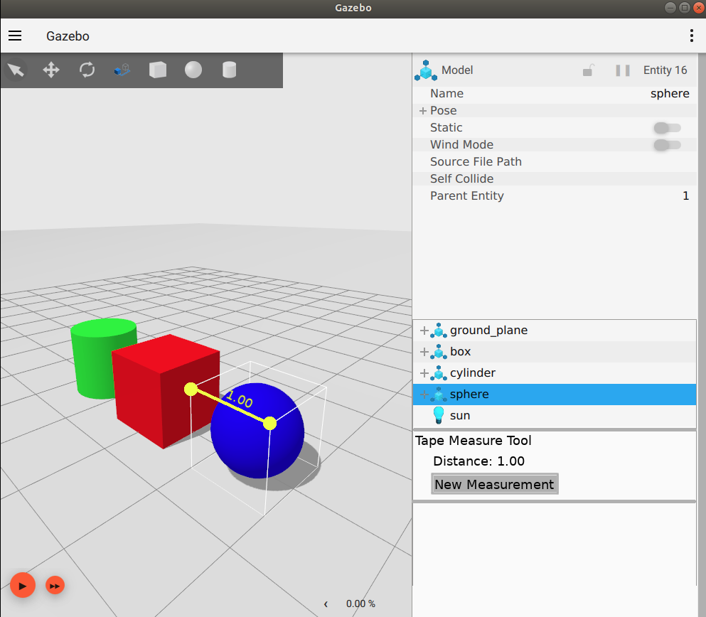

# Tape Measure Tool

This document outlines the design for the tape measure tool targeted at
Ignition Dome and onwards.  The reasoning for the targeting of Dome is largely
due to the snapping behavior which needs bounding boxes.  If this measurement
tool is needed for Citadel, I can try to make a prototype version that doesn't
have any of the more complex snapping capabilities and target it towards
Citadel.

## Purpose

The tape measure tool, as its name implies, is a tool that aids the user in
measurements of distance within a 3D scene. Currently, there is no method
of extracting any sort of measurement data.  This sort of information is data
that is quite useful to a user working within Ignition Gazebo, whether it be
making various calculations or designing/creating a world and needing exact
precision.  It can also just be simply because it is easy to lose the scale of
the world and the objects within it when working within a simulator. This
functionality will also be quite convenient with the eventual addition of
entity scaling.  On a tangent, the dimensional data of an entity, which I
assume will be a reason for which this tool will be used the most, could also
likely be placed within the Component Inspector plugin so the user isn't left
clicking all of the bounds of an entity and having to manually keep track of
the entity's dimensions themselves.  There is an issue out for similar type
improvements [here](https://github.com/ignitionrobotics/ign-gazebo/issues/158)
where I expect to eventually add this information to the Component Inspector.

## Functionality

The tape measure tool is likely to be very simplistic in nature, but has
potential to have certain nuances that this design doc is intended to flesh
out.

I expect the user experience to be something like the following:
 1. The user adds the Tape Measure Tool plugin via the plugin menu.
 2. At this point, I suppose there could be a button one could click
    that is something like "New measurement" at which point would enable
    the tape measure tool.  There could also be a hotkey to start a new
    measurement so the user can quickly take measurements without having
    to constantly click the "New Measurement" button.
 3. The mouse could then change into a cross-shaped icon and display a
    transparent point which gives a preview of the point to be measured,
    this point will become opaque once the user clicks.
 4. We have two options at this point, neither of which would differ
    in behavior, we could either:
    * Have a click system where the user clicks point A and then clicks
      point B.
    * Have a drag system where the user clicks on a particular point, holding
      down the mouse and dragging the cursor to the desired end point.
 5. When the user does either of the above two, points should appear at point
    A and point B, and the user should see a marker line between the two
    points, even while being in the process of choosing point B.
 6. The distance can be written in text along the line marker that appears
    between the two points as well as written in a text box within the plugin
    window.
 7. At any point during this process, the user can press escape or right click
    to cancel the measurement.
 8. The user can hold control to snap to certain key points such as the
    boundaries of an entity's bounding box, the corners of those bounding
    boxes, or the grid lines as well.

## UI Design

I don't expect this one to be too complicated, here's a simple mock-up of
something I made.  My GIMP skills aren't too great so this is just a simple
prototype, color of the line marker and GUI layout are likely going to change
and are open for suggestions.  I just chose yellow as it was the most
contrasting color in the shapes scene.  Note that the "New Measurement"
section is supposed to be a button.  After making this picture, I realized
that an xyz axis placed at point A may also be helpful for the user.

## Nice to haves

 * Display bounding boxes when hovering during the selection.
 * Manipulating the end points once the tape measure is placed.
 * Specifying the length of the tape so that it will lock to that length.
 * Specifying an angle (relative to the x, y, or z axis, I suppose) that the
   tape measure will lock to.
 * Hold shift to snap and constrain the tape measure to the closest axis.

## Questions of functionality

 * Should we allow multiple measurements within the scene or only one?
 * Should we attach the marker to the model/link if the user clicks one?
   See [Louise's Gazebo Classic example here](https://www.youtube.com/watch?v=XjszkNSthok&feature=youtu.be)
 * Perhaps we could eventually just have a button for this next to the
   translational tool buttons and offer it as a default tool?
 * Does anyone see any potential problems or have any concerns?
